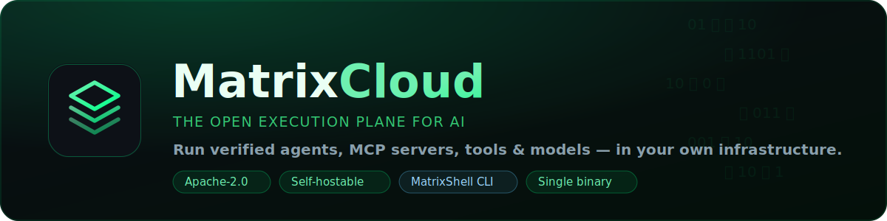
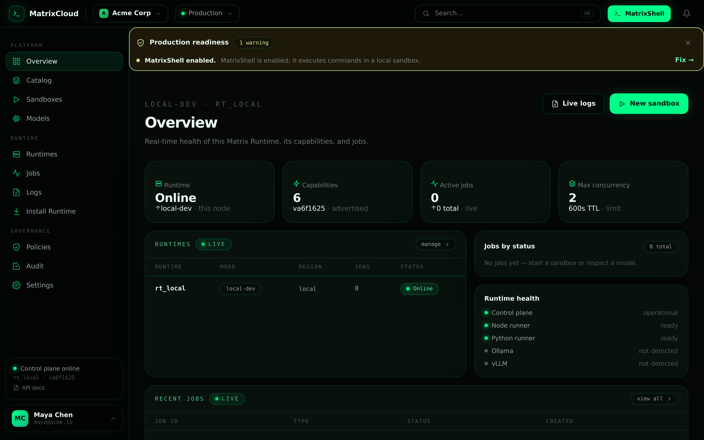
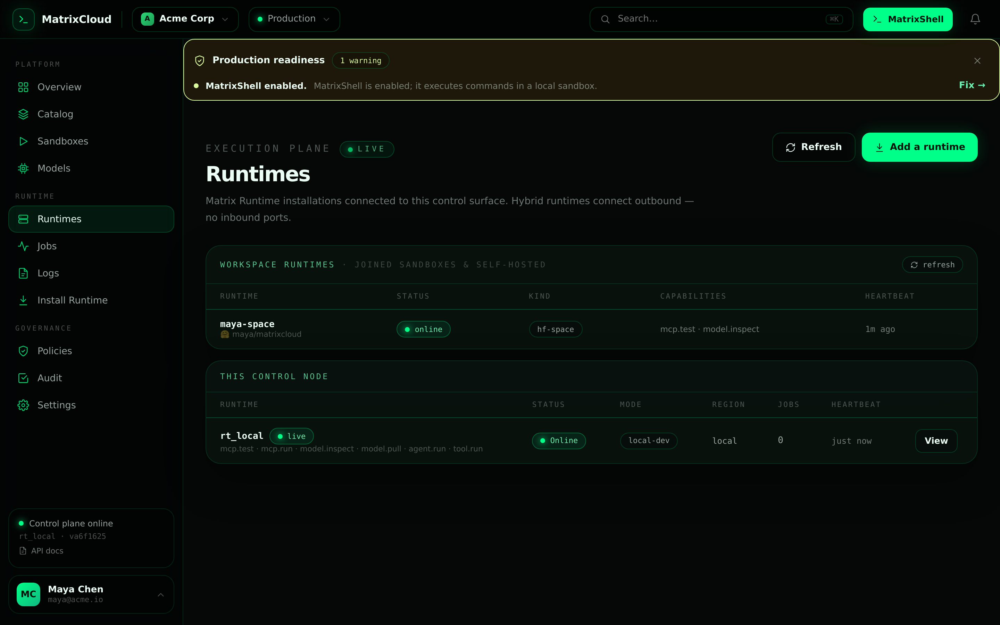
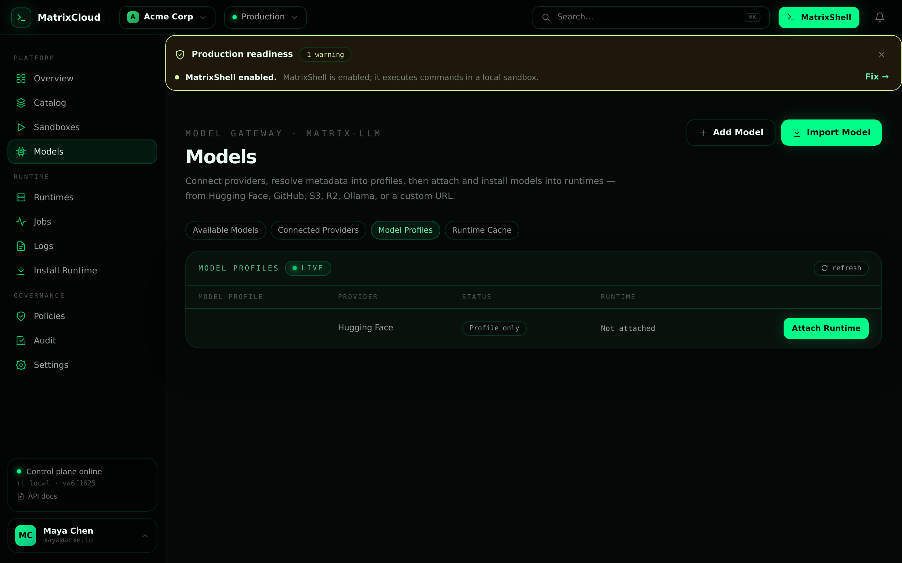
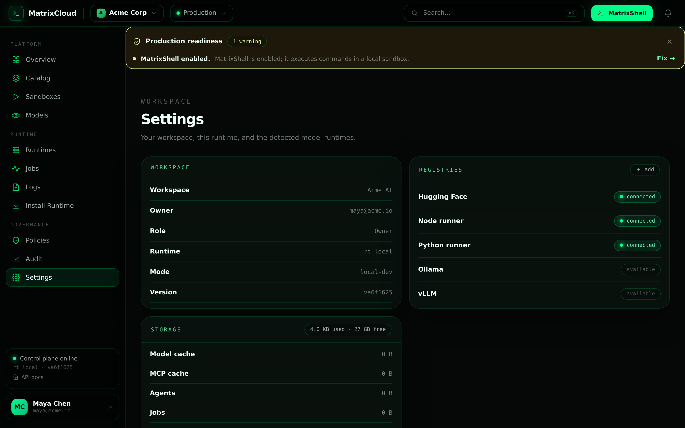

<div align="center">



<h3>Run verified AI agents, MCP servers, tools &amp; models — inside your own infrastructure.</h3>

<p>
  <b>Matrix&nbsp;Runtime is the self-hostable execution plane for MatrixCloud.</b>
  A SaaS-style control plane orchestrates jobs; the runtime executes them where
  your data lives — outbound-only, secrets never leave. One static binary ships
  the API, a premium console, the <b>MatrixShell</b> operator terminal, and a
  multitenant user store.
</p>

<p>
  
  
  
  
  
  
  
</p>

<p>
  <a href="#-quick-start"><b>Quick start</b></a> ·
  <a href="docs/console.md"><b>Console &amp; MatrixShell</b></a> ·
  <a href="#-try-it-free-hosted"><b>Try it free</b></a> ·
  <a href="docs/install-hybrid.md"><b>Hybrid cloud</b></a> ·
  <a href="api/openapi.yaml"><b>API</b></a> ·
  <a href="docs/auth.md"><b>Multitenancy</b></a>
</p>

<br/>



<sub>The premium console ships <b>inside the binary</b> — no separate frontend to deploy.</sub>

</div>

---

> **Naming.** **MatrixCloud** is the product (the hosted control plane at
> `cloud.matrixhub.io`). **Matrix Runtime** is its self-hostable execution
> plane — this repository, `agent-matrix/matrix-runtime`. The console is the
> **MatrixCloud console**. We use these consistently; "matrix-runtime" only
> refers to the binary/package.

---

## ⚡ Quick start

```bash
git clone https://github.com/agent-matrix/matrix-runtime
cd matrix-runtime
make run          # builds the console, starts the API + SQLite, opens on :8080
```

Open **http://localhost:8080**, create a workspace, and you're live. That single
command starts the **whole MatrixCloud**: REST API, the embedded enterprise
console, the MatrixShell terminal, and the multitenant user database — no
external services, no CDN, no database server.

```bash
# or install it (auto-elevates with sudo when needed)
sudo make install                     # -> /usr/local/bin/matrix-runtime
make install PREFIX=$HOME/.local      # user install, no root
matrix-runtime --mode local-dev
```

> **One binary = backend + frontend.** The React console is compiled and
> embedded via `go:embed`; the SQLite driver is pure-Go — so the result is a
> single, static, air-gap-friendly executable.

---

## ✨ Why MatrixCloud

| | |
|---|---|
| 🧪 **Test before you trust** | Spin up any MCP server in a **10-minute sandbox** over stdio, run `initialize` + `tools/list`, call tools live, then auto-expire — no production secrets. |
| 🖥️ **MatrixShell, for real** | Installs the real [`matrixsh`](https://github.com/agent-matrix/MatrixShell) CLI into a **Python venv sandbox on the host** and runs commands there — describe what you want, get a command with a **risk level**, confirm, run. Hard safety denylist. |
| 📥 **Generic model importer** | Import model **profiles** from Hugging Face (live search), GitHub, GitLab, S3, R2, Ollama or a URL; **attach & install** onto a runtime with a real `model.attach` job that streams progress and persists to SQLite. |
| 🔌 **Hybrid by design** | Control plane stays SaaS; the runtime dials **outbound only** from your network. Secrets, internal APIs and model access never leave. |
| 🧠 **Model gateway** | Resolve `hf:Qwen/Qwen2.5-7B-Instruct` to task, license, parameter estimate and a recommended runtime — live via `model.inspect`. |
| 🏢 **Multitenant** | SQLite-backed users, **workspaces (tenants)** and sessions with PBKDF2-hashed passwords. |
| ✅ **Real, not a demo** | Every console view renders live backend data (runtimes, catalog, jobs, policies, audit) — no fabricated clusters, throughput, or install counts. |
| 📦 **Ships as one binary** | Static, `CGO_ENABLED=0`, version-stamped, **auto-picks a free port**. Run it locally, in Docker, on Kubernetes, in a Hugging Face Space, or as a hardened systemd service. |
| 🪶 **Apache-2.0** | Truly open. Self-host it, fork it, build on it. |

---

## 🧩 Architecture

```
            ┌──────────────────────────────┐
            │     MatrixHub Cloud (SaaS)    │   control plane
            │  catalog · jobs · policies    │
            └───────────────▲──────────────┘
                            │  outbound-only · no inbound ports
        ┌───────────────────┴───────────────────┐
        │            Matrix Runtime              │   execution plane  ← this repo
        │  MCP sandboxes · agents · tools ·      │   (single binary)
        │  model jobs · MatrixShell · console    │
        │  + SQLite multitenant users            │
        └───────────────────┬───────────────────┘
                            │
                   ┌────────▼────────┐
                   │   matrix-llm    │   OpenAI-compatible model gateway
                   └─────────────────┘
```

| Plane | Repo | Role |
|------|------|------|
| Control plane | [`ruslanmv/matrixhub`](https://github.com/ruslanmv/matrixhub) | Catalog, workspaces, jobs, policies (SaaS) |
| **Execution plane** | **`agent-matrix/matrix-runtime`** | Runs everything, in your infra |
| Model gateway | [`agent-matrix/matrix-llm`](https://github.com/agent-matrix/matrix-llm) | OpenAI-compatible routing |
| Operator CLI | [`agent-matrix/matrix-cli`](https://github.com/agent-matrix/matrix-cli) · [`MatrixShell`](https://github.com/agent-matrix/MatrixShell) | Keyboard-native operations |

---

## 🖥️ The console &amp; MatrixShell

Start the runtime and open `/` — a premium, embedded **MatrixCloud** console
(login/signup, Overview, Catalog, Sandboxes, Models, Runtimes, Jobs, Logs,
Policies, Audit, Settings), all wired to the live `/v1` API.

<table>
  <tr>
    <td width="50%"></td>
    <td width="50%"></td>
  </tr>
  <tr>
    <td width="50%"></td>
    <td width="50%"></td>
  </tr>
</table>

<p align="center"><sub>Overview · Runtimes (with a joined Hugging&nbsp;Face Space) · Models · Settings — the embedded console, served from the single binary.</sub></p>

### 🧑‍💻 MatrixShell — a real sandbox, not a mock

Open **MatrixShell** from the top bar. One click **installs the real `matrixsh`
CLI** (`pip install` from git) into a dedicated **Python venv on the runtime's
host**, then runs your commands inside that sandbox for real:

```
sandbox> matrixsh --help          # runs in the venv — real output
sandbox> python -c "print(6*7)"   # 42
sandbox> show me recent jobs
  ⟶  Suggested command · risk: low
      matrix ps            [ Yes, run ]  [ No ]
sandbox> matrix status            # control-plane call (live /v1)
  runtime rt_local · mode local-dev · v0.1.0
```

- **`matrix …`** commands hit the control plane (`/v1/health`, `/v1/jobs`,
  `model.inspect`); everything else **executes in the sandbox venv** via
  `POST /v1/matrixshell/exec`.
- Plain-English requests become a command with a **low / medium / high** risk
  badge and require explicit confirmation; a hard denylist blocks destructive
  operations (`mkfs`, `dd`, `shutdown`, `rm -rf /`, fork-bombs …).
- Endpoints: `GET /v1/matrixshell/status`, `POST /v1/matrixshell/install`
  (streams real pip/venv output over SSE), `POST /v1/matrixshell/exec`.

> The Python sandbox uses `uv` (fast) or `python -m venv`. On a fresh host the
> install runs once and is reused.

### 📥 Models — import → attach → ready

The **Models** area is a generic, multi-source importer with four lifecycle
tabs (Available · Connected Providers · Model Profiles · Runtime Cache). The
rule: *importing ≠ downloading ≠ attaching ≠ ready*.

1. **Import Model** → resolve a profile from **Hugging Face** (live search via a
   server-side proxy), GitHub, GitLab, S3, R2, Ollama or a custom URL.
2. **Attach & install** → creates a real `model.attach` job that streams the
   lifecycle over SSE (`checking_runtime → checking_disk → checking_gpu →
   fetching_metadata → downloading → verifying → creating_profile → attached →
   ready`) and persists profiles + installations to SQLite.
3. **Runtime Cache** shows live download progress until **Ready**.

See [docs/console.md](docs/console.md).

---

## 🔐 Multitenant accounts (SQLite)

Sign-in is backed by a real database (`<data>/matrixcloud.db`, pure-Go driver).
First sign-up creates a **workspace (tenant)** + Owner; passwords are hashed with
**PBKDF2-HMAC-SHA256** (stdlib only); sessions are bearer tokens.

```bash
curl -s -X POST localhost:8080/v1/auth/signup \
  -H 'Content-Type: application/json' \
  -d '{"name":"Maya Chen","email":"maya@acme.io","password":"secret123"}'
```

See [docs/auth.md](docs/auth.md).

---

## 🚀 Deploy anywhere

| Target | Command |
|---|---|
| **Local** | `make run` |
| **Binary** | `sudo make install` · `make install PREFIX=$HOME/.local` |
| **Docker** | `make docker && docker run -p 8080:8080 matrix-runtime:local` |
| **Kubernetes (Helm)** | `helm install matrix-runtime ./deploy/helm/matrix-runtime` |
| **Hugging Face Space** | `MATRIX_RUNTIME_MODE=hf-space` (Docker Space) |
| **systemd (hardened)** | `sudo make install INSTALL_SYSTEMD=1` |

Runtime modes: `cloud-worker` · `customer-agent` · `hf-space` · `local-dev`.
Full guides in [`docs/`](docs/).

### 🆓 Try it free (hosted)

You can run MatrixCloud for free to test it — see **[docs/deploy-free.md](docs/deploy-free.md)**:

| Where | Free? | Best for |
|---|---|---|
| **Local / WSL** (`make run`) | yes | full features incl. the MatrixShell sandbox — recommended |
| **GitHub Codespaces** | free monthly hours | one-click cloud dev box, forward port 8080 |
| **Hugging Face Spaces** (Docker) | yes (CPU) | a shareable hosted demo; set `MATRIX_RUNTIME_MODE=hf-space` |
| **Google Cloud Run** | generous free tier | scales to zero; ephemeral disk (SQLite resets) |
| **Render / Koyeb / Fly.io** | free / trial tiers | container deploy from this repo's Dockerfile |
| **Oracle Cloud Always Free** | yes (persistent VM) | a real always-on box (systemd install) |

> Free tiers are **CPU-only** (model *weights* won't serve) and usually have an
> **ephemeral disk** (accounts/cache reset on restart). `model.inspect`, import,
> sandboxes, jobs and MatrixShell all still work. For persistence + GPU, use a
> small VM or your own infra.

---

## 🧪 Job types

| Type | Status |
|---|---|
| `mcp.test` | ✅ 10-minute sandbox (initialize → tools/list → tools/call) |
| `model.inspect` | ✅ Hugging Face metadata + runtime recommendation |
| `model.attach` | ✅ install a profile onto a runtime; SSE progress persisted to `model_runtime_installations` |
| `matrixshell.install` | ✅ build the Python venv + install `matrixsh` (streamed) |
| `model.pull` | 🟡 stages cache + metadata (weights deferred) |
| `mcp.run` · `model.preload` · `agent.run` · `tool.run` | ◻️ defined, stubbed |

---

## 🛠️ Make targets

```bash
make help        # list everything (pretty)
make run         # start the whole MatrixCloud on :8080
make build       # build bin/matrix-runtime (backend + embedded console)
make web         # rebuild the console bundle (esbuild)
make test        # fmt-check + go vet + race tests + coverage
make install     # install backend + frontend (sudo auto-detected)
make venv        # create the Python client .venv with uv (fast)
make setup       # build the runtime + set up the Python venv (full dev setup)
make docker      # container image
make release     # cross-compile linux/darwin × amd64/arm64
```

> Windows/WSL: a `.gitattributes` keeps line endings LF so `make test` stays
> happy. If a checkout introduced CRLF, run `make fmt` (or `make normalize`).

### 🐍 Python client &amp; CLI

A first-class Python SDK + CLI lives in [`clients/python`](clients/python),
managed by [**uv**](https://docs.astral.sh/uv/) for fast, reproducible installs:

```bash
make venv                  # uv creates clients/python/.venv and installs matrixcloud
cd clients/python
uv run mxc signup          # create a workspace + owner
uv run mxc status          # live runtime health + capabilities
uv run mxc inspect hf:Qwen/Qwen2.5-7B-Instruct
```

```python
from matrixcloud import MatrixCloud
with MatrixCloud("http://localhost:8080") as mc:
    mc.login("you@acme.io", "secret123")
    print(mc.inspect_model("hf:Qwen/Qwen2.5-7B-Instruct")["recommended_runtime"])
```
---

## 🛡️ Security

Safe-enough sandboxing for verified MCP servers: a start-command **allow-list**
(`npx`, `uvx`, `pipx`, `python`, `node`), rejection of shell chaining / redirects /
backgrounding, **raw-secret rejection**, TTL ceilings and per-job temp dirs.
Set `MATRIX_RUNTIME_API_TOKEN` to gate the operator API. See
[docs/security.md](docs/security.md).

---

## 🗺️ Roadmap

- [x] Generic multi-source model importer (profiles → attach → ready)
- [x] Real MatrixShell Python sandbox (install + exec)
- [x] Real backend data everywhere (runtimes, catalog, policies, audit)
- [ ] Per-workspace scoping of jobs &amp; sandboxes; member invites, RBAC, SSO
- [ ] Persistent `mcp.run`, `agent.run`, `tool.run`
- [ ] Real weight pull/serve into Ollama / vLLM / SGLang on GPU runtimes
- [ ] Route MatrixShell NL→command suggestions through a paired MatrixLLM gateway
- [ ] Outbound control-channel tunnel (push jobs from the control plane)

---

## 🤝 Contributing

PRs welcome! `make test` must pass (fmt-check + vet + race + coverage). Develop
on a feature branch, keep changes focused, and add a test. New to the codebase?
[`docs/architecture.md`](docs/architecture.md) is the fastest way in.

---

<div align="center">

### ⭐ If MatrixCloud saves you time, give it a star — it genuinely helps.


**Apache-2.0** © 2026 Matrix Cloud / agent-matrix contributors · *there is no spoon.*

</div>
